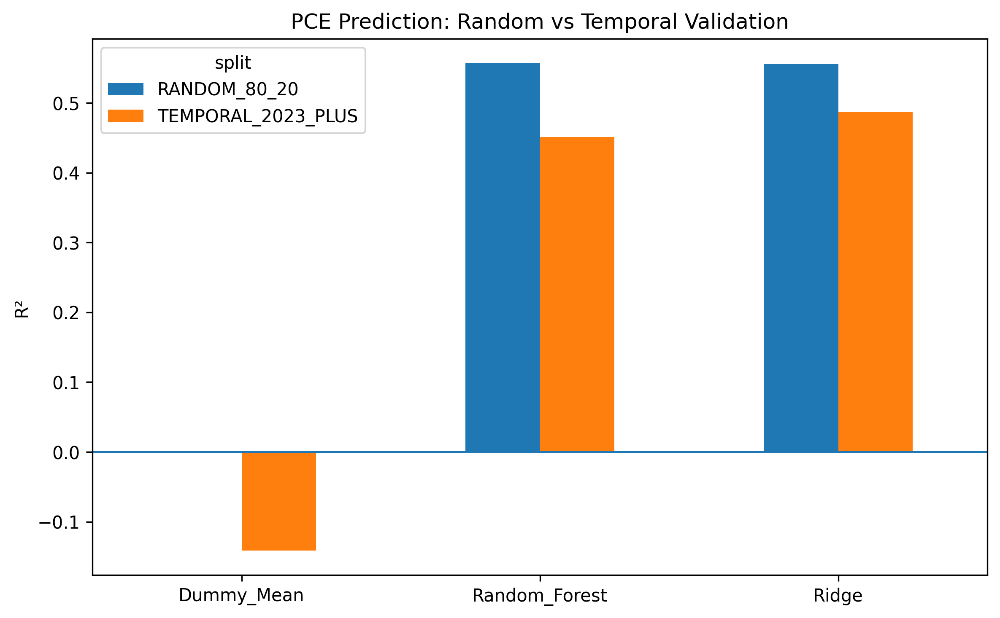
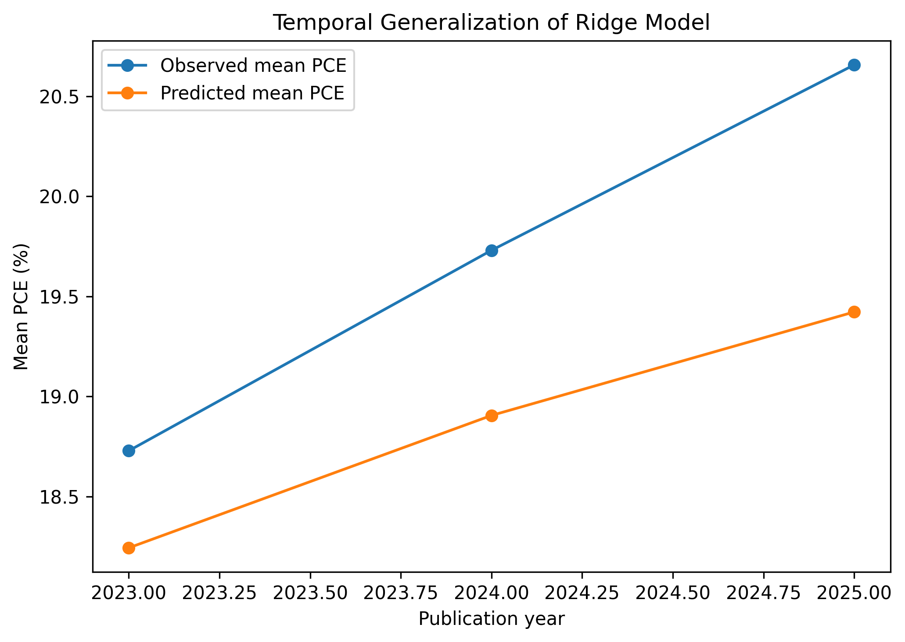
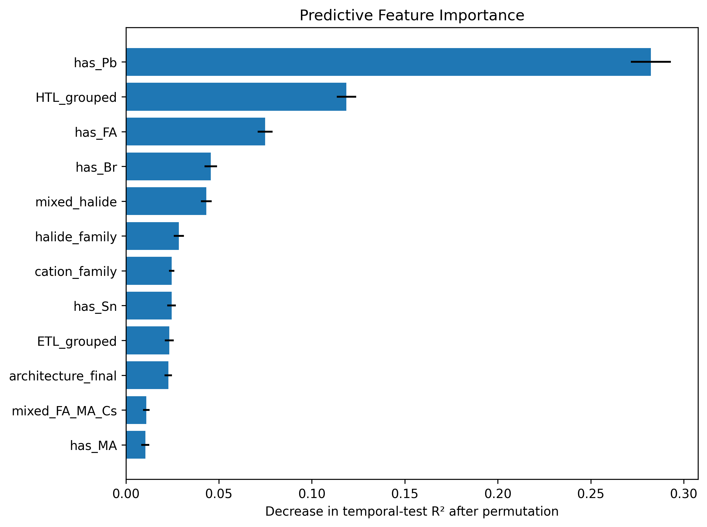
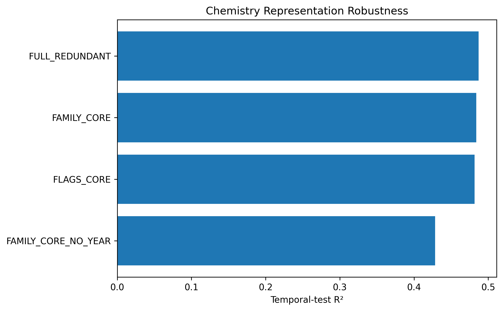
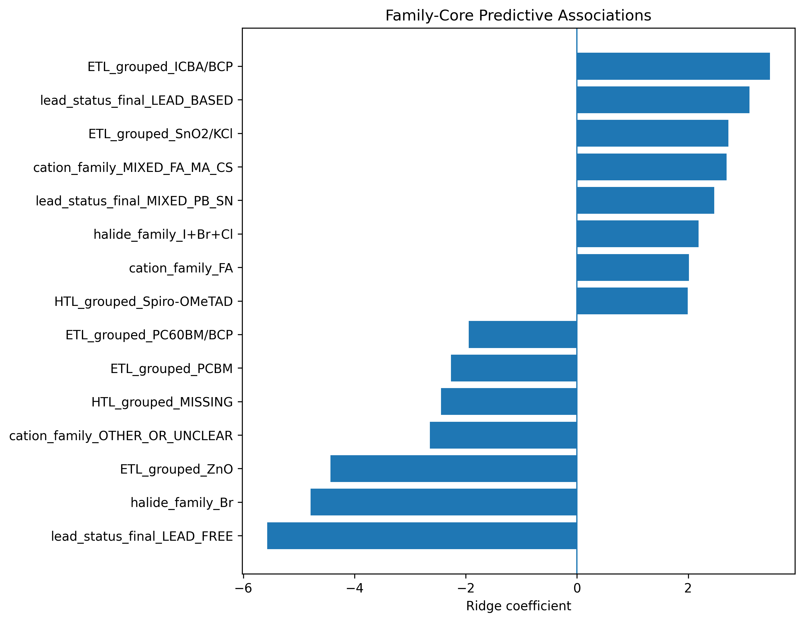

# Evidence-Grounded Scientific Data Curation with LLMs
## A Perovskite Solar Cell Case Study

An end-to-end scientific data curation and machine-learning pipeline for experimental perovskite solar-cell datasets.

The project combines deterministic quality-control rules, semantic normalization, DOI-linked scholarly evidence, structured LLM-assisted review, chemistry-aware feature engineering, and temporally held-out machine-learning validation.

The central goal is not simply to train a predictive model, but to build a traceable workflow that converts heterogeneous literature-derived records into a scientifically curated and model-ready dataset.

---

## Project Overview

Scientific datasets extracted from the literature often contain:

- inconsistent material naming,
- ambiguous device architectures,
- missing or malformed absorber descriptions,
- mixed conventions for photovoltaic parameters,
- duplicate or malformed DOI identifiers,
- inconsistent ETL/HTL terminology,
- uncertain scope,
- and records that cannot safely be resolved using simple rules.

This project addresses these issues through a staged curation pipeline:

```text
Raw PerovskiteNet data
        │
        ▼
Photovoltaic QC
        │
        ▼
Rule-based semantic curation
        │
        ▼
Semantic review queue
        │
        ▼
DOI normalization and evidence retrieval
        │
        ▼
Evidence-grounded structured LLM review
        │
        ▼
Trusted semantic dataset
        │
        ▼
Chemistry-aware feature engineering
        │
        ▼
Leakage-safe PCE prediction
        │
        ▼
Random + temporal validation
```

---

## Dataset Flow

The workflow progressively reduces ambiguity while preserving provenance.

| Stage | Records |
|---|---:|
| Raw dataset | 10,258 |
| Performance-trusted records | 7,173 |
| Rule-resolved before external review | 7,008 |
| Core semantic-review cases | 165 |
| External-evidence / LLM-review cases | 139 |
| Final model-ready records | 7,046 |
| Remaining manual-review records | 95 |

The final model-ready dataset contains records satisfying the semantic-resolution and scope policy used in this project.

---

## Photovoltaic Quality Control

Initial data filtering applies physically motivated bounds to reported photovoltaic performance.

The trusted-data rules include:

```text
0.1 ≤ PCE ≤ 35
0.3 ≤ Voc < 1.6
1 ≤ |Jsc| ≤ 35
0.2 ≤ FF ≤ 0.95
relative PCE consistency error ≤ 20%
```

A consistency estimate is calculated using:

```text
PCE_calc = Voc × |Jsc| × FF
```

The relative difference between reported and reconstructed PCE is used as an additional quality-control criterion.

---

## Rule-Based Semantic Curation

Before using an LLM, deterministic rules are applied wherever possible.

The rule layer performs:

- architecture normalization,
- PSC scope screening,
- quantum-dot case detection,
- lead-chemistry classification,
- missing-absorber detection,
- and semantic-review routing.

Architecture labels are normalized to:

```text
NIP
PIN
UNKNOWN
```

Initial chemistry labels include:

```text
LEAD_BASED
LEAD_FREE_CANDIDATE
MIXED_PB_SN
NO_PB_AMBIGUOUS
UNCLEAR
NOT_APPLICABLE
```

Ambiguous records are preserved for later review rather than aggressively classified.

---

## Evidence-Grounded Curation

A central design principle is that LLM output is **not treated as unrestricted ground truth**.

External scholarly evidence is linked through DOI-based metadata retrieval and categorized into evidence levels.

### ABSTRACT_GROUNDED

A usable publication abstract is available.

Structured LLM outputs may contribute to automatic resolution only when:

- the requested semantic task is explicitly defined,
- the evidence level is sufficient,
- the confidence threshold is met,
- the scope guard is satisfied,
- and deterministic post-processing accepts the result.

### TITLE_STACK_ONLY

Only publication-title and device-stack information is available.

These cases are restricted to:

```text
manual review only
```

They are never automatically accepted or excluded.

This policy separates **LLM assistance** from **automatic semantic decision-making**.

---

## Semantic Review Tasks

Evidence-assisted review is restricted to predefined semantic tasks:

```text
RESOLVE_ABSORBER
RESOLVE_CHEMISTRY
RESOLVE_ARCHITECTURE
RESOLVE_QD_SCOPE
```

Possible final curation outcomes include:

```text
AUTO_ACCEPT_COMPLETE
AUTO_EXCLUDE_NON_PSC
PARTIAL_MANUAL_REVIEW
MANUAL_REVIEW
```

Automatic decisions use confidence thresholds and evidence-level constraints.

Weak-evidence cases remain unresolved instead of being guessed.

---

## DOI Quality Control

DOIs are normalized before external evidence matching.

The workflow supports:

- DOI normalization,
- repaired DOI mappings,
- original-to-resolved DOI provenance,
- canonical DOI generation,
- and validation of evidence links.

Malformed DOI values are not silently replaced; repaired identifiers remain traceable to their original values.

---

## Chemistry Feature Engineering

Heterogeneous absorber strings are transformed into structured chemical descriptors.

Examples include:

```text
has_Pb
has_Sn
has_Cs
has_FA
has_MA
has_I
has_Br
has_Cl
mixed_FA_MA_Cs
mixed_halide
Pb_Sn_mixed_detected
cation_family
halide_family
```

The chemistry parser was cross-checked against curated chemistry labels.

Among the 7,046 model-ready records, only two absorber strings produced a parser/curation mismatch. Both corresponded to generalized absorber descriptions where Pb was not explicitly written in the absorber string.

---

## Transport-Layer Normalization

ETL and HTL terminology is conservatively canonicalized.

For example, variants such as:

```text
spiro-OMeTAD
Spiro-MeOTAD
Spiro-OMeTAD
```

are normalized to:

```text
Spiro-OMeTAD
```

Several compact/mesoporous TiO2 naming variants are also consolidated.

Rare transport-layer categories are grouped during model preparation to reduce excessive categorical fragmentation.

---

## Leakage-Safe PCE Prediction

The machine-learning target is:

```text
PCE
```

Direct photovoltaic performance variables are deliberately excluded from the predictor set:

```text
Voc
Jsc
Jsc_model
FF
PCE_calc
relative_error
```

This prevents direct target leakage because PCE is physically derived from voltage, current density, and fill factor.

The predictive features instead describe:

- absorber chemistry,
- device architecture,
- ETL,
- HTL,
- cation family,
- halide family,
- composition complexity,
- and publication year.

---

## Machine-Learning Models

Three reference models are evaluated:

- Dummy mean regressor
- Ridge regression
- Random Forest regression

The project uses both conventional random validation and chronological validation.

---

## Random 80/20 Validation

| Model | MAE | RMSE | R² |
|---|---:|---:|---:|
| Random Forest | 2.690 | 3.835 | 0.557 |
| Ridge | 2.784 | 3.841 | 0.555 |
| Dummy Mean | 4.464 | 5.764 | -0.001 |

Random Forest and Ridge perform similarly under a conventional random split.

---

## Temporal Validation

A stricter chronological evaluation is used to test generalization to later publications.

Training period:

```text
2017–2022
```

Temporal test period:

```text
2023–2025
```

| Model | MAE | RMSE | R² |
|---|---:|---:|---:|
| Ridge | 2.986 | 3.963 | 0.487 |
| Random Forest | 3.116 | 4.100 | 0.451 |
| Dummy Mean | 5.058 | 5.911 | -0.141 |

Ridge generalizes better than Random Forest on the temporally held-out test set.

---

## Random vs Temporal Validation



The temporal split is more demanding than random validation and provides a stronger test of generalization to later literature.

---

## Temporal Performance Shift

The Ridge model increasingly underpredicts mean reported PCE for later publication years.

| Year | Observed Mean PCE | Predicted Mean PCE | MAE |
|---|---:|---:|---:|
| 2023 | 18.73 | 18.24 | 2.82 |
| 2024 | 19.73 | 18.90 | 3.03 |
| 2025 | 20.66 | 19.42 | 3.25 |

The mean prediction error becomes increasingly negative over time.



This pattern is consistent with temporal performance shift that is not completely captured by the earlier training data.

---

## Predictive Feature Importance

Permutation importance is evaluated on the temporally held-out test set.



Among the strongest predictive features are:

- Pb-containing chemistry,
- HTL category,
- FA-containing chemistry,
- Br-containing chemistry,
- mixed-halide composition,
- halide family,
- cation family,
- Sn-containing chemistry,
- ETL category,
- and device architecture.

Publication year contributes additional predictive information but is not the dominant predictor.

These values represent **predictive associations**, not causal effects.

---

## Temporal Ablation Study

A feature-family ablation study evaluates where predictive signal originates.

| Feature Set | R² |
|---|---:|
| Full model | 0.487 |
| Chemistry + device, without year | 0.430 |
| Chemistry only | 0.371 |
| Device only | 0.128 |
| Year only | 0.014 |

The `YEAR_ONLY` model has very little predictive power.

Most predictive signal is retained using chemistry and device descriptors.

Adding publication year improves temporal calibration, but the model does not rely primarily on publication date.

---

## Compact Chemistry Representation

The original model contains partially redundant representations, such as:

- chemistry-family labels,
- element-presence flags,
- mixed-composition indicators.

A compact **Family-Core** representation was therefore evaluated.

| Representation | Raw Features | MAE | R² |
|---|---:|---:|---:|
| Full redundant | 18 | 2.986 | 0.487 |
| Family Core | 7 | 2.993 | 0.484 |
| Flags Core | 15 | 2.991 | 0.482 |
| Family Core without year | 6 | 3.269 | 0.428 |

The seven-feature Family-Core representation loses only:

```text
ΔR² ≈ -0.003
```

relative to the full 18-feature representation.



This indicates that most predictive information can be retained using a substantially simpler and more interpretable representation.

---

## Interpretable Predictive Associations

Ridge coefficients from the Family-Core representation are used to investigate predictive direction while reducing chemistry redundancy.



Examples of observed associations include:

- lead-based chemistry associated with higher predicted PCE,
- mixed FA/MA/Cs compositions associated with higher predicted PCE,
- FA-family absorbers associated with higher predicted PCE,
- Br-only absorber families associated with lower predicted PCE,
- Spiro-OMeTAD associated with higher predicted PCE relative to several HTL categories,
- and missing HTL information associated with lower predicted PCE.

These are **dataset-level predictive associations**.

They should not be interpreted as direct causal material-performance relationships.

---

## Statistical Support Checks

Coefficient magnitude alone is not treated as sufficient evidence for a scientific conclusion.

Category-support analysis is used to identify low-sample findings.

Examples of well-supported categories include:

- SnO2 ETL,
- Spiro-OMeTAD HTL,
- PTAA,
- PEDOT:PSS,
- NIP architecture,
- PIN architecture,
- mixed FA/MA/Cs absorbers,
- I-containing absorbers,
- and I+Br absorber families.

Some transport-layer categories have limited train/test support and are therefore treated as exploratory.

---

## Repository Structure

```text
perovskite-solar-cell-data-analysis/
│
├── README.md
├── .gitignore
│
├── src/
│   ├── README.md
│   ├── chemistry_parser.py
│   ├── semantic_rules.py
│   ├── evidence_curation.py
│   ├── feature_engineering.py
│   ├── modeling.py
│   └── evaluation.py
│
├── results/
│   ├── README.md
│   ├── perovskite_ml_benchmark_v1.csv
│   ├── perovskite_temporal_ridge_importance_v1.csv
│   ├── perovskite_temporal_error_by_year_v1.csv
│   ├── perovskite_temporal_ablation_v1.csv
│   ├── perovskite_category_support_v1.csv
│   ├── perovskite_binary_feature_support_v1.csv
│   ├── perovskite_temporal_representation_robustness_v1.csv
│   └── perovskite_family_core_coefficients_v1.csv
│
└── figures/
    ├── README.md
    ├── figure1_random_vs_temporal_r2.png
    ├── figure2_temporal_pce_by_year.png
    ├── figure3_permutation_importance.png
    ├── figure4_representation_robustness.png
    └── figure5_family_core_coefficients.png
```

---

## Source Code

The reusable implementation is organized under `src/`.

### `semantic_rules.py`

Implements deterministic photovoltaic QC and semantic-review rules.

### `evidence_curation.py`

Implements:

- DOI normalization,
- DOI repair mappings,
- evidence-level policy,
- semantic-task routing,
- confidence thresholds,
- abstention logic,
- and deterministic post-processing of structured LLM outputs.

### `chemistry_parser.py`

Converts heterogeneous absorber strings into structured chemical descriptors.

### `feature_engineering.py`

Implements:

- ETL normalization,
- HTL normalization,
- rare-category grouping,
- and leakage-safe feature construction.

### `modeling.py`

Implements:

- preprocessing pipelines,
- Dummy baseline,
- Ridge regression,
- Random Forest,
- random validation,
- temporal splitting,
- and regression metrics.

### `evaluation.py`

Implements:

- temporal permutation importance,
- error analysis by publication year,
- temporal ablation studies,
- coefficient extraction,
- categorical support analysis,
- and binary chemistry support analysis.

---

## Design Principles

This project follows several conservative scientific-data principles.

### 1. Rules Before LLMs

Deterministic transformations are preferred whenever possible.

### 2. Evidence Before Automation

Automatic LLM-derived decisions require usable scholarly evidence.

### 3. Abstention Over Guessing

Unresolved or weak-evidence cases remain in manual review.

### 4. Provenance Preservation

Original and resolved semantic values are kept conceptually separate.

### 5. No Direct Performance Leakage

Direct components of the PCE equation are excluded from model predictors.

### 6. Temporal Validation

Models are evaluated on later publications, not only random splits.

### 7. Association Is Not Causation

Feature importance and regression coefficients are interpreted as predictive associations.

### 8. Support-Aware Interpretation

Large coefficients from low-support categories are treated as exploratory rather than definitive findings.

---

## Limitations

- Literature-derived datasets inherit reporting and publication biases.
- ETL and HTL nomenclature remains heterogeneous even after conservative normalization.
- Some transport-layer categories have limited statistical support.
- Composition parsing is based primarily on reported absorber strings.
- Semantic resolution depends on the scholarly evidence available for each DOI.
- LLM-assisted review does not replace expert scientific validation.
- Temporal underprediction indicates continuing domain shift as reported PSC performance improves.
- Predictive associations should not be interpreted as experimental causal effects.

---

## Future Work

Potential extensions include:

- evidence retrieval from full-text publications where licensing permits,
- richer stoichiometric composition parsing,
- uncertainty-aware prediction,
- ontology-backed semantic representations,
- graph-based representations of complete device stacks,
- automatic scientific provenance tracking,
- more advanced temporal-domain adaptation,
- and prospective validation on newly published PSC records.

---

## Data Availability

The project was developed using the publicly available **PerovskiteNet** dataset.

This repository focuses on:

- source code,
- curation methodology,
- aggregated model-evaluation outputs,
- robustness analyses,
- and figures.

Record-level processed datasets are not redistributed here pending verification of the redistribution and licensing conditions associated with the original dataset.

---

## Reproducibility

The repository separates the workflow into reusable Python modules so that the major processing steps can be independently inspected and reproduced.

The analysis pipeline includes:

```text
quality control
→ semantic normalization
→ evidence-grounded review
→ chemistry parsing
→ feature engineering
→ leakage-safe modeling
→ temporal validation
→ robustness analysis
```

No API credentials are stored in this repository.

---

## Authors

### Amir Jaberi
PhD Candidate in Computer Science at the Free University of Bozen-Bolzano (unibz), Italy.

Research interests include:

- artificial intelligence,
- knowledge representation and reasoning,
- ontologies and knowledge graphs,
- large language models,
- neurosymbolic AI,
- semantic data engineering,
- and evidence-grounded scientific knowledge curation.
- 
### Forouzan Habibi, PhD
Researcher with a background in optics and laser physics, computational photonics, metasurfaces, nanophotonics, and scientific data analysis.

Research interests include:

- computational optics and photonics,
- metasurfaces and nanophotonics,
- photovoltaic data analysis,
- scientific AI,
- physics-informed simulation,
- and evidence-grounded scientific data workflows.

